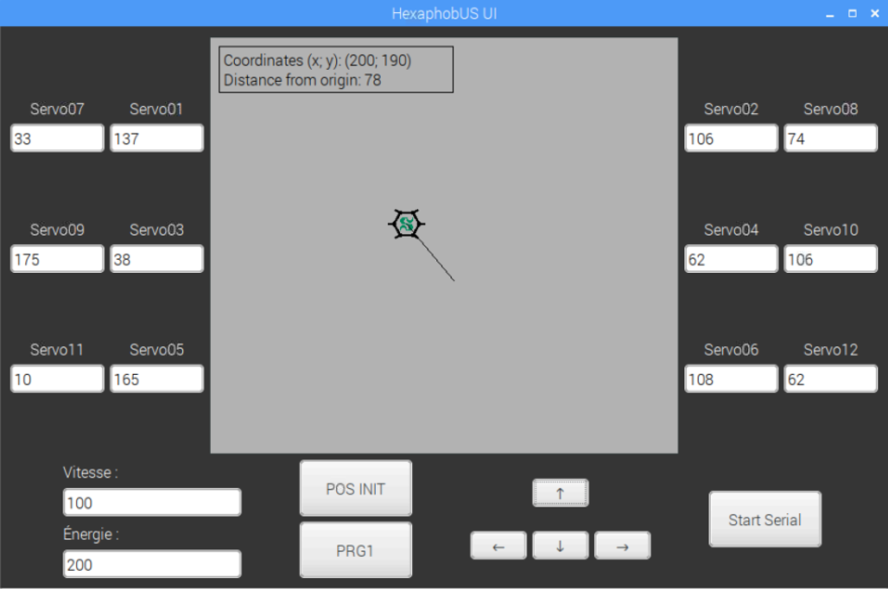

<div id="hexaphobus-logo" align="center">
    
    <h1>HexaphobUS</h1>
    <h3>Hexapod robot | UdeS-GRO</h3>
</div>

[//]: # (------------------------------------------------)

<div id="badges" align="center">
    
[](https://travis-ci.com/gabrielcabana21/HexaphobUS)
[](http://makeapullrequest.com)
[](https://github.com/FARM3R8OY/HexaphobUS/blob/master/LICENSE) 

</div>

[//]: # (------------------------------------------------)

**This is an academic project from robotic engineering undergraduates at Université de Sherbrooke. We are building a 6-axis robot from scratch with motion control, sequencing, and an intuitive user interface.**

<div id="robot" align="center">
    
</div>

## Table of Contents
- [Setup](#Setup)
    - [Setup for Users](#SetupUsers)
    - [Setup for Repository Contributors](#SetupContrib)
- [Documentation](#Documentation)
- [Robot Operation](#Operation)
- [External Resources](#Resources)
    - [Battery, Power Source, and Charger](#Battery)
    - [Crimping Tool Kit](#Crimp)
    - [Microcontroller Board](#Controller)
    - [On-Board Computer](#Computer)
    - [PWM Servo Driver](#PWM)
    - [Servomotor](#Servo)
    - [Voltage Regulator](#Regulator)
    
[//]: # (------------------------------------------------)

## <a id="Setup"></a>Setup

#### <a id="SetupUsers"></a>Setup for Users

- Clone or download the repository;
- Connect the hexapod's microcontroller (Arduino) to your computer;
- Open the file ```hexaphobus_pwm.ino``` in the *./Code/hexaphobus_pwm* folder, and build the code into the microcontroller with your favorite IDE;
- Disconnect the microcontroller and connect the on-board computer (Raspberry Pi) instead (or connect remotely);
- Verify your Python version (3.5 and above);
- Run the file ```hexaphobus_ui.py``` in the *./Code/hexaphobus_ui* folder;
- Initialize the serial communication.

#### <a id="SetupContrib"></a>Setup for Repository Contributors

To setup the Git, the Key Management System and/or the Integrated Development Environment, head over to the [code setup file](./Code/setup.md). You can also add your own method, so the file can act as a setup archive for various softwares and operating systems.

To add new functions, refine the code, redesign the 3D model, and more, fork your own copy of the repository and [make a pull request after modifications](http://makeapullrequest.com).

## <a id="Documentation"></a>Documentation

All the code documentation can be found [here](https://raw.githack.com/gabrielcabana21/HexaphobUS/code/docs/html/index.html).

## <a id="Operation"></a>Robot Operation

<div id="hexaphobus-ui" align="center">
    <br />
    
</div>

- &#8593;: forward motion;
- &#8595;: backward motion;
- &#8592;: left turn;
- &#8594;: right turn;
- <kbd>POS INIT</kbd>: resets the robot origin;
- <kbd>PRG1</kbd>: pre-programmed motion sequence (currently unused);
- <kbd>Start Serial</kbd>: initializes serial communication with the robot;
- Servo ##: displays the servomotor angle (position of servos on the interface mimicks the robot seen from above);
- Vitesse / Énergie: robot speed and energy consumption (currently unused).

## <a id="Resources"></a>External Resources

Under this section, you will find external links and descriptions of the project's external resources.

#### <a id="Battery"></a>Battery, Power Source, and Charger
- Brand Name: Makita
- Model:
    - Battery: BL1041B
    - Power Source: PE00000028
    - Charger: DC10SB
- ASIN:
    - Battery: B017GQJDVM
    - Charger: B01FY4XCB0
- Information / Resources:
    - [Makita Battery Webpage](https://www.makitatools.com/products/details/BL1041B)
    - [Makita Power Source Webpage](https://www.makitatools.com/products/details/PE00000028)
    - [Makita Charger Webpage](https://www.makitatools.com/products/details/DC10SB)

#### <a id="Crimp"></a>Crimping Tool Kit
- Brand Name: Preciva Dupont
- Model: PR-3245 (SN-28B) + JST-XH
- ASIN: B07R1H3Z8X
- Information / Resources: [Amazon Link](https://www.amazon.com/gp/product/B07R1H3Z8X/)

#### <a id="Controller"></a>Microcontroller Board
- Brand Name: Arduino
- Model: Mega 2560 R3 (A000067)
- ASIN: B0046AMGW0
- Information / Resources: [Arduino Webpage](https://store.arduino.cc/mega-2560-r3)

#### <a id="Computer"></a>On-Board Computer
- Brand Name: Raspberry Pi
- Model: 3B
- ASIN: B01LPLPBS8
- Information / Resources: [Raspberry Pi Webpage](https://www.raspberrypi.org/products/raspberry-pi-3-model-b/)

#### <a id="PWM"></a>PWM Servo Driver
- Brand Name: SunFounder
- Model: PCA9685
- ASIN: B014KTSMLA
- Information / Resources: [Sunfounder Wiki](http://wiki.sunfounder.cc/index.php?title=PCA9685_16_Channel_12_Bit_PWM_Servo_Driver)

#### <a id="Servo"></a>Servomotor
- Brand Name: Hitec RCD
- Model: HS-422
- ASIN: B0006O3WWI
- Information / Resources: [Hitec Webpage](https://hitecrcd.com/products/servos/sport-servos/analog-sport-servos/hs-422/product)

#### <a id="Regulator"></a>Voltage Regulator
- Brand Name: DROK
- Model: 090483
- ASIN: B00C4QVTNU
- Information / Resources: [DROK Webpage](https://www.droking.com/Adjustable-High-Power-Adapter-Buck-Voltage-Regulator-DC8-40V-to-1.25-36V-8A-100W-Converter-Laptop-Charger)
